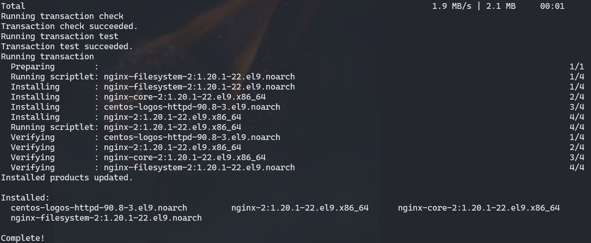
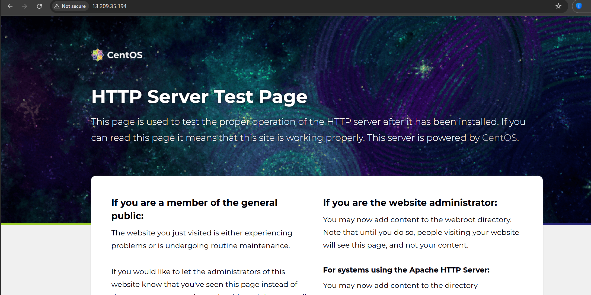
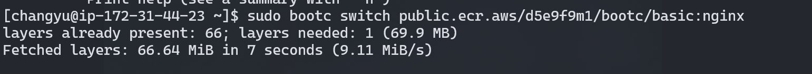
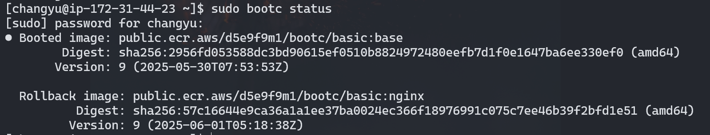

### GOAL
1. Understand concept of `bootc`
2. try `bootc upgrade` and `bootc rollback`
3. run `bootc` on AWS.


#### 1. Build bootc image
1. Cloud-init만 포함한 기본 이미지를 세팅하였다.

```Dockerfile
## Basic Version
FROM quay.io/centos-bootc/centos-bootc:stream9

RUN dnf -y install cloud-init && \
    systemctl enable cloud-init.service && \
    dnf clean all

EXPOSE 22
```
2. podman을 사용하여 build

```
podman build -t .
```

### 2. Build bootable ISO by bootc image

1. `1.`에서 빌드한 Image를 bootable하게 만들어야 한다.
   1. 이때 bootc-image-builder를 컨테이너에서 사용하여 빌드한다.
   2. 왜냐하면 Container 이미지 자체는 이미지를 압축해서 저장하는 양식이고, 그것을 Hardware 위에서 바로 실행할 수 없기 때문이다.
2. Upload bootc image to public ECR
   1. bootc-image-builder 내부에서 bootable하게 만들 이미지를 받아야 한다.
   2. 어차피 local podman에 있는데 굳이?? 싶지만 이유가 있다.  
      1. 사실 어차피 로컬의 repository를 마운트로 연결해서 괜찮을 것 같지만, 권한 때문에 터지는 것 같다.
         1. 그래서 그냥 외부 repository를 만드는게 더 편할 것 같다.
      2. 어차피 이따 AWS에 빌드하기 위해서는 aws cli를 사용한다.
      3. 이후에 bootc에서 이미지를 가져올때 ECR에 있는 이미지를 직접 가져온다.

local의 이미지로 바로 build 시도하였을때의 에러
```
 window9u@wsl  /mnt/c/Users/CHANGYU/VSCODE/init-os-image/changyu/simple demo/demo-files   INITOS-CHANGYU/demo-aws ±  sudo podman run \      --rm \
  -it \
  --privileged \
  --security-opt label=type:unconfined_t \
  -v $HOME/.aws:/root/.aws:ro \
  -v /var/run/podman/podman.sock:/var/run/podman/podman.sock \
  -v /var/lib/containers/storage:/var/lib/containers/storage \
  -v ${CONFIG_PATH}:/config.toml:ro \
  --env AWS_PROFILE=default \
  quay.io/centos-bootc/bootc-image-builder:latest \
  --type ami \
  --aws-ami-name "${AMI_NAME}" \
  --aws-bucket "${S3_BUCKET_NAME}" \
  --aws-region "${AWS_REGION}" \
  "${IMAGE_PATH}"                                                                                                                       <.... 
[|] Manifest generation step
Message: Generating manifest manifest-ami.json
2025/05/30 08:11:30 error: cannot build manifest: failed to inspect the image: exit status 125, stderr:
time="2025-05-30T08:11:30Z" level=error msg="Refreshing container 
```


#### 3. Build image `AMI` type and push to AWS

1. bootc-builder에서 2에서 만든 이미지를 bootable하게 만든다.
   1. 이때 bootc를 실행하기 위한 환경으로 bootc-builder 이미지를 만든다.
   2. 본인은 wsl 환경인데 해당 환경에서 bootc를 직접 사용할 수 없다.
2. trouble shooting
   1. aws 계정에 충분한 권한을 주는 것이 좋을 것 같다.
      1. S3 - Image를 올리는데 필요 + 미리 bucket은 수동으로 생성해놓기
      2. ECR 
      3. EC2 - ec2:DescribeRegions
   2. bootc-image-builder 컨테이너가 실행되기 전에 호스트 시스템의 Podman에서 대상 이미지를 미리 다운로드해 두어야 한다.
      1. ERROR: bootc-image-builder no longer pulls images, make sure to pull it before running bootc-image-builder: sudo podman pull public.ecr.aws/**/bootc/test:latest
      2. 그럼 굳이 ECR에 이미지를 올려야 하나..?
   3. aws에 vmimport 서비스 생성 및 권한 부여
      1. ERROR: InvalidParameter: The service role vmimport provided does not exist or does not have sufficient permissions.
      2. vmimport role을 만드는 것은 console에 해당 메뉴가 없어서 꼭 cli에서 수행해야 한다.

#### 실습 과정

vmimport role 만들고 권한 붙여놓기

[AWS reference](https://docs.aws.amazon.com/ko_kr/vm-import/latest/userguide/image-import.html)

```sh
aws iam create-role --role-name vmimport --assume-role-policy-document "file:///mnt/c/Users/CHANGYU/~~/trust-policy.json"\n
```

이미지 build 이후 aws의 ami store에 push 까지
```sh
sudo podman run \
  --rm \
  -it \
  --privileged \
  --security-opt label=type:unconfined_t \
  -v $HOME/.aws:/root/.aws:ro \
  -v /var/run/podman/podman.sock:/var/run/podman/podman.sock \
  -v /var/lib/containers/storage:/var/lib/containers/storage \
  -v ${CONFIG_PATH}:/config.toml:ro \
  --env AWS_PROFILE=default \
  quay.io/centos-bootc/bootc-image-builder:latest \
  --type ami \
  --aws-ami-name "${AMI_NAME}" \
  --aws-bucket "${S3_BUCKET_NAME}" \
  --aws-region "${AWS_REGION}" \
  "${ECR_IMAGE_PATH}"
```


빌드 후 10GB 이미지 푸시가 매우 오래걸림.. 30분 넘게 걸린 듯


중간에 S3에 image가 저장되었다 사라지는 것을 볼 수 있다.


connect ssh


sudo apt install nginx 시도

그런데 password를 몰라서 설치를 못할 것 같다..(config.toml에 pw 미설정함)
그렇다면, 혹시 pw가 있으면 설치를 할 수 있는건가??

 --- 
이후 config.toml에 password 추가하여 다시 build

sudo dnf install nginx가 안되는 모습


--transient 사용하여 임시 설치






성공

하지만 reboot이후 nginx 날라감


nginx 이미지 굽고 ECR에 푸시 이때, 다시 bootc-image-builder를 사용할 필요는 없고 이제부터는 bootc 명령어를 사용하여 Registry에서 upgrade가 가능하다.

```
FROM quay.io/centos-bootc/centos-bootc:stream9

RUN dnf -y install cloud-init nginx && \
    systemctl enable cloud-init.service nginx && \
    dnf clean all

EXPOSE 22 80
```

bootc switch로 교체. 이전 이미지와 tag가 달라서 upgrade가 아니라 switch 사용.



staged image에 nginx 이미지가 보임.


reboot 이후 


nginx가 돌아가고 있다.


rollback 결과 rollback image와 booted image가 바뀌어 있음.



### Questions
- 위의 과정에서 가장 귀찮은 작업은 bootc-image-builder로 bootable 이미지를 만드는 것이고, 그 이후에는 정말 편하다.
  - 그럼 가장 처음 구워서 bootable os로 만드는 ISO는 가볍게 만들고, 이후에 Docker든 K8S든 까지 잘 세팅한 OS Container Image로 bootc upgrade 하는 것이 좋지 않나???
  - 그냥 bootc ISO 이미지 자체를 가볍게 만들고 일단 올리기만 하면 bootc upgrade로 다른 것들을 사용할 수 있는데, 굳이 처음부터 풀세팅된 이미지로 ISO를 구워야 하나??
- 결국 bootc 명령어를 사용하기 위해서는 sudo 혹은 root가 필요한데, 이걸 하려면 config.toml에서 password를 설정하거나 root를 세팅해야 한다. 근데 password를 평문으로 저장하는 것이 마음에 들지는 않는다.
  - 지금 생각나는 것은 password 자체를 환경변수로 세팅하고, 이걸 CI에서 동적으로 넣어주기..?

