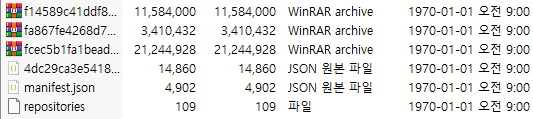

# Definitions

관련 개념 정리하기

## OCI 표준

### OCI란

- Open Container Initiative(OCI): 컨테이너 기술의 표준화를 통해 도구 간 호환성과 상호 운용성을 확보하는 것을 목표로 설립되었으며 runtime, image, distribution에 대한 3가지 핵심 명제를 통해 컨테이너 생태계를 위한 공통 기반을 제공함
- 2015년 주요 기업의 협력으로 설립되었으며 현재는 Linux Foundation 산하
    - 2015년 다양한 컨테이너 도구가 각기 다른 포맷으로 경쟁하며 생태계 분열 조짐을 보임
    - 업계 표준을 정립함으로서 호환성과 유지보수 측면의 문제를 제거하였음

### OCI의 5가지 원칙

1. 표준 동작(Standard Operations)
    - 생성, 시작, 정지, 스냅샷, 복사, 업로드, 다운로드 등의 컨테이너 동작이 표준화된 도구로 가능해야함
2. 내용 중립성(Content-agnostic)
    - 컨테이너 내부 어플리케이션 종류에 상관없이 일관된 동작을 제공해야함
3. 자동화를 위한 설계(Designed for Automation)
    - 표준화된 방식으로 자동화된 CI/CD 파이프라인 구성에 적합해야함
4. 산업 수준의 배포(Industry-grade Delivery)
    - 개인 개발자부터 대기업까지 산업 수준에 맞는 배포 환경을 제공해야함
5. 인프라 중립성(Infrastructure-agnostic)
    - 클라우드, 온프레미스 등 다양한 인프라에서 OCI를 지원하는 한 동일한 방식으로 실행 가능해야함

### OCI의 3가지 핵심 명제

#### Runtime Specification (runtime-spec)

- 컨테이너를 실제로 실행하기 위한 명세
- 컨테이너 런타임의 동작 방식과 인터페이스를 표준화하여 다양한 런타임(runc, crun 등)이 동일한 방식으로 컨테이너를 실행할 수 있도록 보장
- 동작 방법:
    - 컨테이너의 설정(config.json 등의 파일 형식), 실행 환경, namespace, cgroup, mount, 보안 옵션 등 컨테이너 실행에 필요한 low level 세부 사항을 정의
    - 컨테이너 엔진(Docker, containerd 등)이 컨테이너를 실행할 때, 이미지에서 추출된 정보와 사용자 입력, 엔진의 기본값을 조합해 config.json을 생성하고 런타임에 전달하여 컨테이너를 실행

#### Image Specification (image-spec)

- 컨테이너 이미지를 구성하는 형식을 정의
- 컨테이너 이미지를 표준화하여 벤더와 플랫폼에 상관없이 호환성과 이식성을 보장하는 명세
    - ex) 하나의 Containerfile을 사용하여 Docker, Podman 등에서 모두 빌드 및 실행이 가능함
    - [컨테이너 이미지 규칙](https://oci-playground.github.io/specs-latest/specs/image/v1.1.0-rc3/oci-image-spec.pdf)
- 구성 요소:
    - **Image Index**: 다양한 CPU 및 OS 아키텍쳐별로 어떤 이미지(manifest)가 있는지 기록한 json 파일로 하나의 이미지가 여러 플랫폼을 지원할 때 사용됨
    - **Image Manifest**: 실제 컨테이너 이미지를 구성하는 요소(설정 정보, 파일 시스템 레이어 등)를 정의한 json 파일로 컨테이너를 어떻게 조립할지에 대한 정보를 담고 있음
    - **Image Config**: 컨테이너 이미지의 실행 환경, 환경 변수, 엔트리포인트 등 실행 메타데이터를 포함함
    - **Image Layer**: 컨테이너 파일 시스템을 구성하는 변경 이력(레이어)로 .tar 형식으로 압축된 파일
- 목적:
    - 상호운용성: 이미지 포맷을 표준화하여 다양한 빌드/배포/실행 도구들이 동일한 방식으로 이미지를 처리함
    - 컨텐츠 주소 지정: 이미지의 각 요소(레이어 설정 등)를 해시 기반으로 고유하게 식별하여 무결성 검증 및 캐싱에 용이함
    - 멀티 아키텍쳐 지원: Image Index를 통해 하나의 이미지가 여러 아키텍쳐를 지원할 수 있도록 함
- docker save / podman image save 등을 사용한 후 생성된 .tar 파일을 열어보면 다음과 같이 해시값으로 저장된 레이어들과 manifest.json 등을 확인할 수 있음 ↓


#### Distribution Specification (distribution-spec)

- 컨테이너 이미지 등을 업로드, 다운로드, 삭제, 조회 등을 표준화하여 컨테이너 레지스트리와 런타임 도구들이 이미지를 상호운용성 있게 주고받을 수 있도록 설계

## docker에서 컨테이너를 빌드하고 띄우면 생기는 일

### 이미지 빌드 프로세스

#### 빌드 전 준비

1. Dockerfile 작성
2. 빌드 컨텍스트 지정
    - `docker build .` 실행 시 현재 디렉터리의 모든 파일이 BuildKit에 전송됨


#### BuildKit 아키텍처

- 기본 엔진: Docker 23.0 이후 BuildKit이 기본 빌드 백엔드
- 구성요소:
    - Frontend: Dockerfile을 LLB(Low-Level Build)로 변환
    - Solver: LLB 그래프 기반 빌드 실행 계획 생성  
      (Dockerfile → LLB → DAG 변환, 의존성 그래프)
    - Executor: 실제 빌드 수행 (임시 컨테이너 생성 및 명령 실행)
    - Cache Manager: 중복 작업 방지 및 레이어 캐시 관리

#### 빌드 흐름

``` yaml
[사용자]
↓ docker build .
[Docker CLI]
↓ Docker daemon
[BuildKit]
↓ Dockerfile → LLB 변환
↓ Build 그래프 생성
↓ 단계별 병렬 실행
↓ 명령 실행 결과를 레이어로 저장
[최종 이미지 생성]
```

#### 최적화 전략

- 중간 레이어 캐시: 동일 명령에 대한 이전 결과 재사용
- 병렬 실행: 비의존적 명령은 동시에 실행
- 멀티스테이지 빌드: 필요 단계만 실행, 최종 이미지 최소화
- 증분 컨텍스트 업로드: 변경된 파일만 전송

### 컨테이너 실행 프로세스

#### 실행 명령 입력

- `docker run`, `docker start`, `docker create` 등의 명령어로 컨테이너 실행

#### 실행 구성요소 계층

``` yaml
[사용자 명령어: docker run]
↓
[Docker Daemon (dockerd)]
↓
[containerd] ← 이미지, 네트워크, 볼륨 등 관리
↓
[containerd-shim] ← runc 호출 및 프로세스 관리
↓
[runc] ← 컨테이너 생성 (PID 1 프로세스 실행)
```

#### 실행 흐름 상세

1. 컨테이너 생성 요청 </br>
    - Docker CLI → dockerd → containerd에 요청 전달
2. containerd-shim 생성 </br>
    - 컨테이너별로 하나씩 실행, runc 호출
3. runc 실행 </br>
    - 컨테이너 프로세스(PID 1)를 네임스페이스와 cgroup으로 격리해 실행, 실행 후 종료
4. containerd-shim 유지 </br>
    - stdin/stdout 연결, Exit Code 추적, 중계 역할

#### 주요 개념

- runc  
   - OCI(Runtime Spec) 준수 저수준 런타임.  
   - 리눅스 네임스페이스 및 cgroup 적용, 격리 환경 생성
- containerd-shim  
   - 컨테이너의 생명주기를 containerd와 독립적으로 유지  
   - containerd가 재시작되어도 컨테이너는 영향 없음

#### 컨테이너 내부 동작

- Dockerfile의 CMD/ENTRYPOINT에 명시된 명령이 PID 1로 실행
- 프로세스가 종료되면 컨테이너도 종료됨
- `-d` 옵션으로 백그라운드 실행 가능

### 컨테이너 라이프사이클 관리

#### 상태(State) 정의

| 상태    | 설명                                         |
|---------|----------------------------------------------|
| Created | 생성만 되었고 실행되지 않음 (`docker create`)|
| Running | 컨테이너 프로세스 동작 중 (`docker start`)  |
| Paused  | 실행 중 컨테이너 일시 중지 (`docker pause`) |
| Stopped | 실행 종료됨 (`docker stop`)                  |
| Deleted | 컨테이너 제거됨 (`docker rm`)                |

#### 상태 전이 흐름

``` yaml
docker create → Created
docker start → Running
docker pause → Paused
docker unpause → Running
docker stop → Stopped
docker rm → Deleted
```

## Bootc 이미지 빌드 및 설치 시 왜 `podman run`을 진행해야 할까?

perplexity作

### Bootc 설치 시 Podman Run 명령어 사용의 기술적 근거

부팅 가능한 컨테이너(bootc)의 설치 프로세스는 전통적인 운영체제 배포 방식과 근본적으로 다른 기술적 접근법을 요구합니다. **Podman run** 명령어의 사용은 단순한 실행 방식의 차이가 아닌, 컨테이너 기반 운영체제의 설계 철학과 시스템 보안 모델이 반영된 필수적인 선택입니다. 이 선택의 배경에는 세 가지 핵심 기술 요구사항이 존재합니다.

#### 1. 컨테이너 이미지 자가 참조 구조 (Self-Contained Image Execution)

Bootc 설치 명령어(`bootc install to-disk` 등)는 반드시 설치 대상이 되는 컨테이너 이미지 **내부에서 실행**되어야 합니다. 이는 bootc의 핵심 설계 원리로, 컨테이너 외부에서 명령어를 실행할 경우 다음과 같은 오류가 발생합니다:

`textError: This command must be run from the target container image`

이 제약은 기술적 결함이 아닌 의도된 동작입니다. 컨테이너 이미지 내부에서 실행됨으로써 다음이 보장됩니다:

- **이미지 무결성 검증**: 설치 과정에서 사용되는 모든 파일이 원본 컨테이너 이미지 레이어에서 직접 추출
- **버전 일관성**: 설치 도구와 대상 OS 이미지의 버전 불일치 방지
- **트랜잭션 안전성**: 원자적(atomic) 업데이트 메커니즘의 정상 작동

#### 2. 특권 작업 수행 요구 (Privileged Operation Requirements)

Bootc 설치 프로세스는 물리적 디스크 파티셔닝, 부트로더 설치, 커널 이미지 추출 등 **저수준 시스템 작업**을 수행해야 합니다. 이를 위해 Podman 실행 시 다음 옵션들이 필수적으로 적용됩니다:

#### 2.1 장치 직접 접근 권한

`bash--privileged -v /dev:/dev`

- **`-privileged`**: 호스트의 모든 장치 노드(/dev/*)에 대한 RAW 접근 허용
- **`v /dev:/dev`**: 호스트 장치 트리를 컨테이너 네임스페이스에 직접 노출
#### 2.2 보안 컨텍스트 설정

`bash--security-opt label=type:unconfined_t`

- SELinux 정책 우회를 통해 디스크 쓰기 작업 수행
- systemd 서비스 활성화 시 발생하는 보안 컨텍스트 충돌 방지

#### 2.3 프로세스 네임스페이스 통합

`bash--pid=host`

- 호스트의 PID 네임스페이스 공유를 통해 부트로더 업데이트 도구(bootupd) 정상 작동
- systemd 서비스 관리자와의 호환성 유지

#### 3. 컨테이너 스토리지 아키텍처 (Container Storage Architecture)

Bootc 설치 프로세스는 Podman의 스토리지 관리 시스템과 밀접하게 연동됩니다. 다음 마운트 옵션이 반드시 필요합니다:

`bash-v /var/lib/containers:/var/lib/containers`

이 설정의 기술적 의미는 다음과 같습니다:

- **레이어드 파일시스템 접근**: OverlayFS/버킷 스토리지에서 컨테이너 이미지 레이어 직접 읽기
- **메타데이터 동기화**: 컨테이너 이미지 태그 정보와 설치 대상 매핑 유지
- **캐시 재사용**: 동일 이미지의 반복 설치 시 레이어 재활용을 통한 성능 최적화

#### 4. 설치 후 업데이트 관리 체계 (Post-Install Update Management)

Podman run 명령어에서 사용된 이미지 참조는 설치된 시스템의 **자동 업데이트 소스**로 자동 등록됩니다. 예를 들어:

`bashpodman run ... quay.io/examplecorp/exampleos:latest bootc install ...`

이 경우 설치된 시스템은 지속적으로 `quay.io/examplecorp/exampleos:latest`에서 업데이트를 확인합니다. 이 메커니즘은 다음과 같은 이점을 제공합니다:

- **버전 추적성**: 설치 출처와 업데이트 소스의 일관성 유지
- **인증 체계 연계**: Podman의 레지스트리 인증 정보와 연동known-issues-containers
- **롤백 기능**: 트랜잭션 기반 업데이트 지원

#### 결론: 기술적 필연성의 종합

Podman run을 통한 bootc 설치 방식은 단순한 명령어 실행 방식을 넘어, **컨테이너 네이티브 운영체제**의 기본 설계 철학을 구현한 기술적 표준입니다. 이 접근법은 하이퍼바이저 기반 가상화의 무거운 추상화 계층을 제거하면서도, 전통적인 베어메탈 설치의 복잡성을 해결하는 혁신적인 균형점을 제공합니다. 특히 GitOps 환경에서의 운영체제 버전 관리와 CI/CD 파이프라인 통합 측면에서 이 방식의 장점이 두드러집니다.