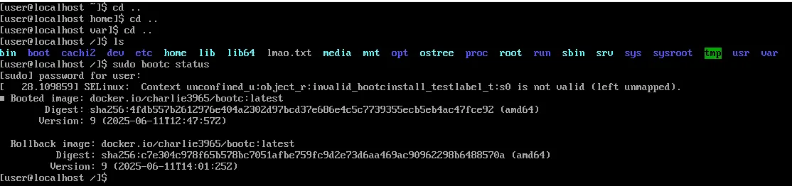
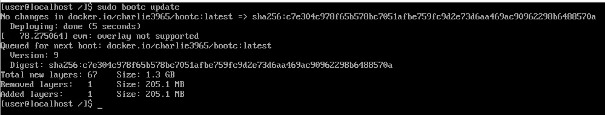
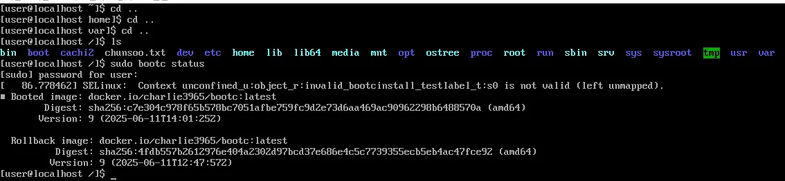
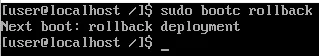
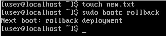
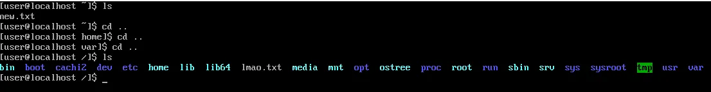

# Use Bootc

bootc의 rollback, update, switch 사용해보기

## 사전준비

- 3가지 이미지를 준비하여 rollback과 update, switch를 수행해보자
- Type-2-Hypervisor(virtual box)에서 진행하였음 ~~그렇다고 다른 환경서 안될 이유는 딱히 없음~~
- Containerfile 이미지 빌드 및 os 이미지 빌드는 start-bootc 문서 참고

### 이미지1

- 이 이미지는 config.toml을 포함하여 vmdk로 빌드한 후 virtual box로 열어 사용하였음
- 실습의 기초가 되는 이미지

Containerfile
``` Conatainerfile
FROM quay.io/centos-bootc/centos-bootc:stream9

# 필수 패키지 설치
RUN dnf install -y httpd nginx  && \
    curl https://get.docker.com/ | sh && \
    dnf config-manager --add-repo https://pkgs.tailscale.com/stable/centos/9/tailscale.repo && \
    dnf -y install tailscale && \
    dnf clean all && \
    ln -s ../tailscaled.service /usr/lib/systemd/system/default.target.wants
```

config.toml
``` toml
[[customizations.user]]
name = "user"           
password = "password"   
groups = ["wheel"]      
```

### 이미지2

- registry에 업로드하여 switch, update, rollback을 수행해보기 위한 이미지
- `touch` 명령어를 사용해 생성한 파일로 현재 이미지를 한번 더 확인할 수 있음

Containerfile
``` Containerfile
FROM quay.io/centos-bootc/centos-bootc:stream9

# 필수 패키지 설치
RUN dnf install -y httpd nginx  && \
    curl https://get.docker.com/ | sh && \
    dnf config-manager --add-repo https://pkgs.tailscale.com/stable/centos/9/tailscale.repo && \
    dnf -y install tailscale && \
    dnf clean all && \
    ln -s ../tailscaled.service /usr/lib/systemd/system/default.target.wants && \
    touch lmao.txt
```

### 이미지3

- registry에 업로드하여 update와 rollback을 수행해보기 위한 이미지
- `touch` 명령어를 사용해 생성한 파일로 현재 이미지를 한번 더 확인할 수 있음
- 빌드시 ARGS로 파일 이름 넣어줘야함. 여기서는 chunsoo로 지정

Containerfile
``` Containerfile
FROM quay.io/centos-bootc/centos-bootc:stream9

ARG FILE lmao

# 필수 패키지 설치
RUN dnf install -y httpd nginx  && \
    curl https://get.docker.com/ | sh && \
    dnf config-manager --add-repo https://pkgs.tailscale.com/stable/centos/9/tailscale.repo && \
    dnf -y install tailscale && \
    dnf clean all && \
    ln -s ../tailscaled.service /usr/lib/systemd/system/default.target.wants && \
    touch ${FILE}.txt
```

## bootc switch

``` shell
sudo bootc switch <REGISTRY-URL>/<namespace>/<image>:<tag>
```

- `이미지1` → `이미지2` `bootc switch` 진행
- 가장 상위 폴더로 이동하면 없던 lmao.txt가 생겨난 것을 확인할 수 있음(bootc status 참고)

## bootc status

``` shell
sudo bootc status
```

- `이미지2`의 bootc status 확인



## bootc update

``` shell
sudo bootc update

# bootc update 완료 후 reboot
sudo reboot
```

- `이미지2` → `이미지3` bootc update 진행



- bootc update 이후에도 reboot 이전까지 최신 이미지가 아닌 기존 이미지로 부팅됨
- bootc update 이후 reboot하여 부팅 순서가 바뀐 최신 이미지로 부팅 가능
- reboot 이후인 아래 이미지에서 `lmao.txt`가 사라지고 `chunsoo.txt`가 생성되었음을 확인할 수 있음



## bootc rollback

``` shell
sudo bootc rollback
```

- bootc update와 마찬가지로 rollback 이후 reboot를 진행해야 이전 이미지로 전환 가능 (reboot 이후는 생략)



## 고찰?

### bootc update / rollback / switch가 일어나더라도 변하지 않는 것들

[참고](https://bootc-dev.github.io/bootc/filesystem.html)

``` shell
# 새로운 파일 생성
touch new.txt

# bootc rollback 후 reboot하여 확인
sudo bootc rollback
sudo reboot
```





- `new.txt`가 rollback 이후에도 남아있음을 확인할 수 있다
- 최상위 폴더의 경우 Containerfile만을 사용하여 파일을 생성할 수 있었으나, `/var`하위는 rollback과 update를 거치더라도 남아있음
    - `/var` has arbitrarily large data (system logs, databases, etc.). It would also not be expected to be rolled back if the operating system state is rolled back. A simple example is that an apt|dnf downgrade postgresql should not affect the physical database in general in `/var/lib/postgres`. Similarly, a bootc update or rollback should not affect this application data.
- `/etc`는 경우에 따라 하위 파일이 남아있기도, 변화하기도 한다고 함
