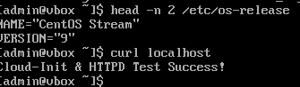

# bootc 시작하기

## TODO

- podman과 bootc-image-builder를 이용해서 bootc 이미지를 빌드
- 빌드한 이미지를 ISO로 변환
- 변환한 ISO 이미지를 토대로 bootc 작업에 적합한 os 배포

## 1. Containerfile 작성

- cloud-init과 간단한 동작 확인을 위한 index.html 작성

```bash
FROM quay.io/centos-bootc/centos-bootc:stream9

# 1. cloud-init 및 httpd 설치
RUN dnf install -y cloud-init httpd && \
    systemctl enable cloud-init.service httpd && \
    dnf clean all

# 2. index.html 생성 (웹 서버 테스트용)
RUN echo "Cloud-Init & HTTPD Test Success!" > /var/www/html/index.html

EXPOSE 22 80

```

```bash
21 files removed
--> 06715efd9c2
STEP 3/4: RUN echo "Cloud-Init & HTTPD Test Success!" > /var/www/html/index.html
--> c2b9d60b780
STEP 4/4: EXPOSE 22 80
COMMIT bootc
--> 7227e433262
Successfully tagged localhost/bootc:latest
7227e433262b2ba7d50f541aa5f6b5f44534c9dd59739a5b240b838de7542735
root@bootc-img:~# podman images
REPOSITORY                         TAG         IMAGE ID      CREATED         SIZE
localhost/bootc                    latest      7227e433262b  15 seconds ago  1.92 GB
quay.io/centos-bootc/centos-bootc  stream9     cdeaee268d85  11 hours ago    1.74 GB
```


빌드가 20초정도밖에 걸리지 않았다.

우선 로컬에서 정상 작동 확인!

## 2. bootc ISO 이미지 빌드

```bash
sudo podman run --rm -it --privileged \
  --security-opt label=type:unconfined_t \
  -v $(pwd)/output:/output \
  -v $(pwd)/config.toml:/config.toml:ro \
  -v /var/lib/containers/storage:/var/lib/containers/storage \
  quay.io/centos-bootc/bootc-image-builder:latest \
  --type iso \
  --config /config.toml \
  --local \
  localhost/bootc:v1
```

```bash
[[customizations.user]]
name = "admin"
password = "*puttyPie*"
groups = ["wheel"]
```

→ ISO 이미지 생성 완료

ISO 이미지 생성에는 15분 정도 걸렸다.

## 3. ISO 이미지를 토대로 vm 구동

### ISO 이미지 클라우드에 업로드

1. NCP Object storage에 버킷 생성하여 업로드
2. Iso 파일 다운로드 하여 로컬에서 vm 생성

### 근데 S3에 업로드가 안된다

```bash
An error occurred (AccessDenied) when calling the UploadPart operation: Access Denied
```

루트라서 권한이 다 있는데도 access denied 가 떠서 찾아보니

파일 용량이 큰 것이 문제인 듯 하다 → iso 이미지 크기 : 2.6GiB

그래서 멀티파트 업로드 진행

근데 이것도 권한 막혀서 해결은 조금 미뤄두고 일단 scp로 파일 다운로드하기로 함

```bash
scp root@110.165.18.106:/root/output/bootiso/bootc-demo.iso .
```

근데 vm에서 돌려보니

`cannot allocate kernel buffer` 오류 발생..

you need to load kernel first라며…

[need to load kernel first?](https://forums.linuxmint.com/viewtopic.php?t=406959)

서칭 결과 내가 메모리를 너무 적게 설정했었던 탓이었음(1000MB로 했었다)

메모리 8000MB정도로 늘려주니 바로 성공!



## Next Time

이제 앞으로

registry 설정하고,

지금은

`error upgrading: creating importer: failed to invoke method OpenImage: failed to invoke method OpenImage: pingin container registry localhost: Get "https://localhost/v2": dial tcp [::1]:443: connect: connection refused`

해당 오류가 나오는 상태

config.toml에 평문으로 비밀번호 저장하는 문제를 개설해야겠다.
