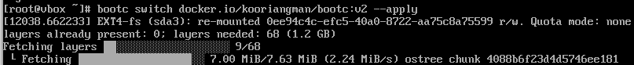
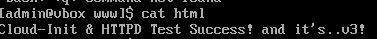
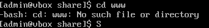
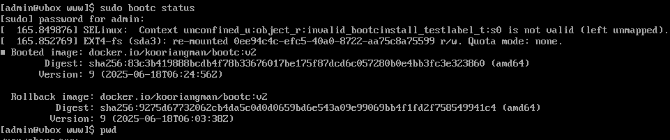

# Setting Registry

cf) Registry vs Repository

Registry

- Registry가 Repository의 상위 개념
- 저장소의 집합

Repository

- 레지스트리 내부에 존재하는 논리적 공간
- 동일한 이름을 가지지만 태그 및 버전이 다른 이미지들의 컬렉션

## 1. registry 설정

### container registry 선정

1. docker hub
    1. private repo가 가능하기는 한데, 1개까지만 무료임
    2. 이전에 public repo로 생성하니 매우 빠르게 다른 사람들이 다운로드 받아 가는 것을 경험 → 보안적으로 위험으로 인해 사용에 불편함이 있음
2. harbor
    1. private registry 오픈소스
    2. cncf graduated프로젝트 - 안정성, 레퍼런스 확보
    3. UI 제공
3. github registry(packages)
    1. 프라이빗 레포의 경우 500mb 용량, 월 1gb 전송량까지 무료

⇒ 관리 및 작업 편의성을 위해 public registry를 택하되, 이전에 써보지 않았던 github packages를 이번에 써보기로 함

## 2. github packages 설정

[컨테이너 레지스트리 작업 - GitHub Docs](https://docs.github.com/ko/packages/working-with-a-github-packages-registry/working-with-the-container-registry)

- 우선 github에서 token 생성(classic)
  - 공식 문서에 따라 최소한의 권한만 부여
    - write:packages
    - read:packages
    - delete:packages
- 이후 `export CR_PAT=YOUR_TOKEN` 으로 토큰을 환경 변수로 저장
- `echo $CR_PAT | docker login ghcr.io -u USERNAME --password-stdin` 를 통해 로그인
- v1 컨테이너 이미지 태킹 및 푸시
  - `docker tag CONTAINERNAME:TAG ghcr.io/USERNAME/CONTAINERNAME:TAG`
  - `docker push ghcr.io/USERNAME/CONTAINERNAME:TAG`
  - 여기에서 사용되는 username에 본인이 지정할 개인 계정 또는 조직의 이름을 작성하면 된다.
- 이제부터 github 내 packages에서 확인 가능

## 3. bootc upgrade

- 간단하게 containerfile 수정하고 빌드
  - `podman build --no-cache -t bootc:v2 .`
- 그리고 다시 깃헙으로 push
  - `docker push ghcr.io/yucori/bootc:v2`
- fedora vm에서 registry 설정
  - registry를 찾을 수 있도록 설정

    ```bash
    # /etc/containers/registries.conf
    [registries.search]
    registries = ['ghcr.io', 'docker.io']
    ```

    - 그리고 아까처럼 token 환경변수로 설정해줌

근데 `sudo bootc switch ghcr.io/yucori/bootc:v2 --apply` 해도 안된다...

근데 또 podman pull은 되는 이상한 상황

github packages 인증 설정 문제인 듯. key가 잘 적용되지 못하고 있는 것 같음. 계속 credential 문제 생김

⇒ invalid username/password:unauthorized

도커 허브로는 매우 잘 됨

`podman switch docker.io/kooriangman/bootc:v2 --apply`



bootc switch로 바로 이미지 변경 완료



이참에 컨테이너 파일에 bootc upgrade도 해보기 위해 수정 사항 업데이트 후, bootc upgrade 진행

- `podman build -t docker.io/kooriangman/bootc:v2 --no-cache .`
- `podman push docker.io/kooriangman/bootc:v2` 로 같은 태그로 내용을 업데이트
- `bootc upgrade --apply`

digest를 기준으로 os 업데이트 하고 드디어 업데이트 확인 + rollback 확인




