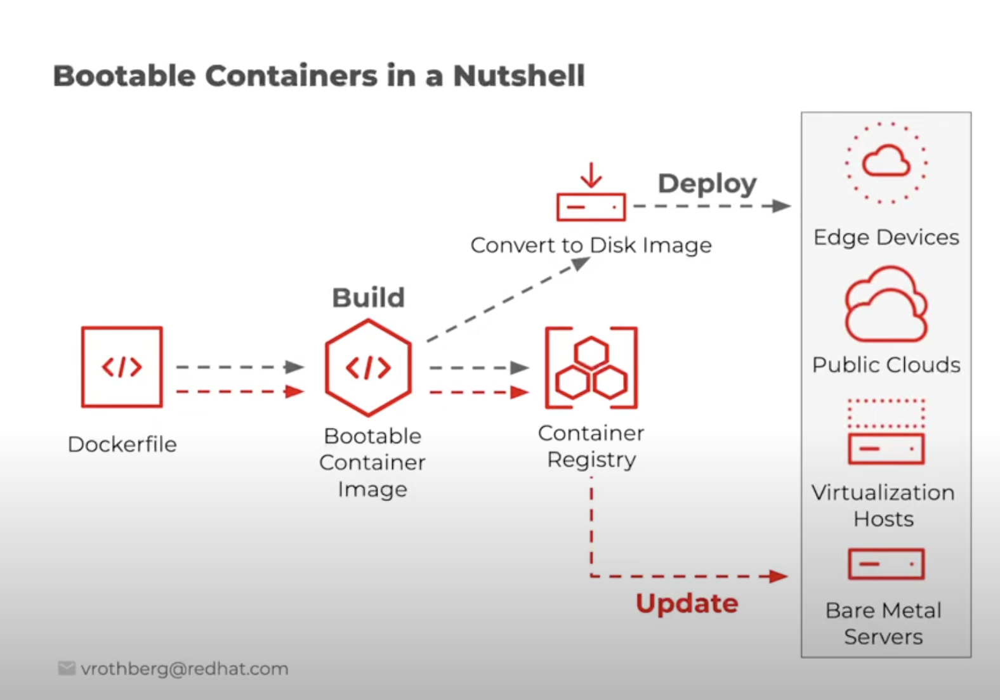

# Start Bootc

## 1. 소개 및 특징

- 레드햇이 후원하고 있는 Fedora linux에서 시작한 프로젝트
- 여담
  - 제가 이런 기술과 기업 관계 알아보는 걸 좋아해서,, 이 김에 알아봤슴다
  - *~~역시 온 세상이 IBM이고 RedHat이네요~~*
  | 항목 | Fedora | RHEL | Rocky Linux |
  | --- | --- | --- | --- |
  | 주체 | 커뮤니티 + Red Hat 후원 | Red Hat (상용 제품) | 커뮤니티 (독립) |
  | 목적 | 최신 기술 실험 | 기업용 상용 OS | RHEL과 100% 호환되는 무료 대체 OS |
  | 관계 | **신기술 실험 → RHEL로 안정화** | Fedora 기반의 안정판 | RHEL을 그대로 복제 |
  | 라이선스 | 오픈소스 | 상용 (하지만 소스는 공개됨) | 오픈소스 |
- 컨테이너 이미지를 통해 시스템을 부팅할 수 있도록 한다(원래 컨테이너는 vm과 달리 부팅이 필요하지 않음)
- **업데이트 효율성과 롤백(버저닝) 기능이 핵심!**
- OCI/Docker 컨테이너 이미지를 사용하여 트랜잭션을 기반으로 자체 운영 체제 업데이트를 가능하게 하는 CLI임
  - 트랜잭션 기반이므로 문제가 생기면 롤백이 가능
- 운영체제를 애플리케이션과 비슷한 방식으로 다루기 위함
- 운영 체제 업데이트와 배포 과정에서 컨테이너 기술을 적용시키기 위한 것
  - os를 이미지처럼 여러 레이어로 나누어 관리하기 위한 것
- 컨테이너 이미지에는 디폴트로는 리눅스 커널이 포함되어, 해당 이미지를 사용해 호스트 시스템을 부팅할 수 있음
- 커널은 크게 건드리지 않고 위의 유저 스페이스 전체를 컨테이너 이미지로 관리하는 것이 중점 → **유저 공간**의 os를 ****관리!
  - 유저 공간을 만드는 재료를 통째로 다루는 도구라는 것
  - 참고로 메모리는 운영 체제 자체와 핵심 기능이 실행되는 커널 공간과, 유저 공간으로 나우어져있음
    - 유저 공간은 시스템콜 인터페이스를 지님 (시스템 콜 자체는 커널에 있음)
- 부팅 속도를 줄이기 위한 것이 아니라, 부팅 이전에 병합된 os 이미지를 보다 더 효율적으로 만들고 관리하기 위한 것임
- 이미지 생성, 바인딩, 테스팅인 표준 OCI tool을 통해 실행되지만 실제로는 하드웨어에서 실행됨
- OS 관리에 사용됨. 특히 os 업데이트를 보다 더 손쉽게 가능하게 함
- 부팅 이후에는 OS가 컨테이너 안에서 돌아가는 것처럼 보이지 않음
  - systemd가 PID 1로 정상 작동함
    - 완전한 리눅스 시스템처럼 동작
  - 컨테이너를 OS 업데이트의 운반 수단으로만 사용하는 것~
- 공식 깃헙에서 CNCF의 Sandbox project라고 하던데 공식 CNCF 홈피에서 안보임 뭐지?
  - ~~실제 CNCF에서 sandbox로 approved 된 거 보면 프로젝트로 등록된 것 같은데 아직 cncf 홈피에 업데이트가 안 된 것 같음~~
    [bootc-cncf-pr](https://github.com/cncf/sandbox/issues/310)
    - 아이콘에 bootc가 안 써있어서 몰랐는데 CNCF 홈피에 있었음
      [bootc](https://www.cncf.io/projects/bootc/)
- 내부적으로 rpm-ostree를 기반 시스템으로 사용하고 있음
- 시스템별 상태 및 데이터는 /etc 및 /var에 설정됨
- 아직 버전 1이 되지 않음. → 프로덕션 용으로는 아직 유의가 필요하다

## ostree (Operating System Tree)

- 시스템 전체(루트 파일 시스템)의 버전 관리 시스템
- 약간 Git 느낌
- fedora 계열에서 자주 사용됨
- 리눅스 운영체제에서 패키지 충돌이나 의존성 문제가 발생하는 등 여러 문제가 발생했을 때 롤백이 가능하도록 함
- 운영체제 전체 버전을 스냅샷처럼 저장하기에 안정적인 롤백 & 배포가 가능

| 기능 | 설명 |
| --- | --- |
| **버전 관리** | Git처럼 루트 파일 시스템을 커밋 단위로 관리 |
| **트랜잭션 업데이트** | 업데이트 중 실패하면 자동 롤백 가능 |
| **이중 부팅 지원** | 기존 OS와 새 OS 이미지를 동시에 유지 가능 |
| **읽기 전용 루트 파일 시스템** | OS를 불변으로 관리 → 보안성 및 안정성 강화 |
| **RPM-OSTree 통합** | Fedora Silverblue, CoreOS 등에서 사용됨 |

### rpm-ostree

- rpm 패키지를 ostree 기반으로 다루는 툴
- 운영체제를 **이미지** 단위로 관리하고, 패키지처럼 커밋 가능
  - 패키지 단위 X
  - 이미지 단위로 관리 = os 전체 상태를 한 번에 관리하고 배포한다는 것

    ### cf) 부분적으로만 업데이트한다면서 왜 전체 이미지라고 하지?

    - 운영체제의 레이어에서 부분적인 변경이 발생할 경우 해당 레이어만 변경됨
    - 근데 bootc는 변경 사항은 다음 부팅 시부터 적용된다는 특징이 있음
    - 따라서 사용자가 볼 때는 다음 부팅에는 완전히 새로운 버전이 붙은 os를 보게 되기에 전체 이미지라고 하는 것
    - 내부적으로는 레이어 별이 맞다~
    - 참고로 루트 파일 시스템은 `/ostree/deploy/` 여기에 설치된다!
- dnf 대신 사용

| 항목 | `rpm` (dnf, yum 등) | `rpm-ostree` |
| --- | --- | --- |
| **업데이트 방식** | 패키지 개별 설치/업그레이드 | 전체 OS를 이미지(트리)로 교체 |
| **적용 시점** | 즉시 적용 | 다음 부팅 시 적용 |
| **루트 파일 시스템** | 읽기/쓰기 가능 | 대부분 읽기 전용 (immutable) |
| **롤백** | 복잡하거나 수동 | **간단한 커밋 롤백 가능** |
| **설치된 소프트웨어 관리** | 실시간 변경 가능 | 이미지에 반영된 후 재부팅 필요 |
| **보안성/안정성** | 변경 흔함 → 변동성 있음 | 불변성 강화, 운영체제 일관성 ↑ |
| **사용 대상** | 데스크탑/서버 일반 리눅스 | Fedora Silverblue, Fedora IoT, CoreOS 등 |

### bootc에서의 역할

- bootc 내부에서 트리 생성 및 커밋 관리
- 실제 파일 시스템을 구성하고 관리하는 백엔드의 역할을 함
- bootc가 이를 감싸서 oci/docker 이미지 중심의 ux를 제공하게 되는 것

| 기능 | 설명 |
| --- | --- |
| 🔨 **컨테이너 이미지의 루트 트리 생성** | 컨테이너 내부의 `/usr` 구조를 `rpm-ostree`의 **OSTree 트리**로 변환 |
| 📦 **트랜잭션 업데이트 적용** | 커밋 기반으로 OS 업데이트를 원자적으로 처리 |
| 🧱 **읽기 전용 루트 파일 시스템 구성** | 컨테이너의 `/usr`를 마운트하여 읽기 전용으로 설정함 |
| 🔄 **롤백 지원** | 이전 커밋 상태로 OS를 되돌릴 수 있게 관리 → 업데이트는 덮어쓰기 방식이 아니라 “다른 커밋으로 전환”되는 형태 |
| 📂 **배포 설치 및 추적** | 어떤 이미지에서 설치되었는지 기록 및 추적 기능 지원 |

## 미니 총평

- 전반적으로 **간편한 업데이트와 버전 관리**를 중점으로 개발된 기술이다~

## 2. 활용처

1. 여러 서버의 인프라를 설정해야 하고 관리해야 하는 경우
2. CI/CD를 통해 os를 관리할 경우
3. 여러 디바이스에 동일한 os를 배포할 경우

## 3. 한계

1. 공식적으로는 아직 특정 이미지에서만 빌드 가능하다
    1. 특정한 종류의 base image만 사용 가능한 상태(ex. Fedora coreOS)
2. bootc로 설치된 시스템만 bootc update 가능
    1. 애초에 bootc 기반으로 설치된 시스템만 추후 추적 및 업데이트 가능
3. 기존 시스템을 bootc로 전환하면, os를 완전히 덮어쓰기에, bootc가 없던 상태로 롤백이 불가하다.
4. 하드웨어~애플리케이션까지 아직 모든 부분의 보안 검증이 이루어지진 않았음
5. 재부팅 시 임시 변경사항이 사라짐
    1. immutable image가 사용되기에 부팅 이후 내부의 변경사항이 영구 저장되지 않음
6. 아직 RPM 기반 패키지 시스템에만 적합

## 4. 참조

1. Hands-on demo by Fedora

  [Bootc: Hands on Demo](https://www.youtube.com/watch?v=fccox6sGCWA)

이 데모 따라하려고 이미지 빌드하다가

도커가 메모리를 27gb나 잡아먹게 되는 상황을 목도했다..

좀 더 경량화된 os 이미지로 실습해야겠다.

1. bootable container에 관하여

  [Goals](https://containers.github.io/bootable/)

1. bootc 공식 문서

  [offical bootc website](https://github.com/containers/bootable)

  [Introduction - bootc](https://bootc-dev.github.io/bootc/intro.html)

1. 학습 자료들

  [Migrating my Fedora Server to fedora-bootc](https://www.youtube.com/watch?v=T9aDEF_4vr8)

  [The Bootc Revolution: One Build Language for VMs and Containers](https://medium.com/%40josephsims1/the-bootc-revolution-one-build-language-for-vms-and-containers-48ecdf7fc7e6)

  [멀티 클라우드 환경에 호환 가능한 클라우드 이미지 개발 - 발표 자료](https://tech.chhanz.xyz/linux/2025/03/21/bootc-meetup/)
