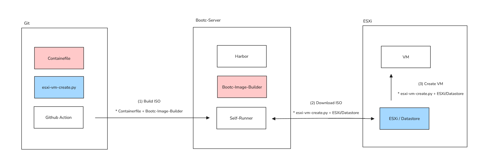
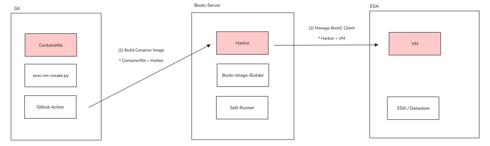
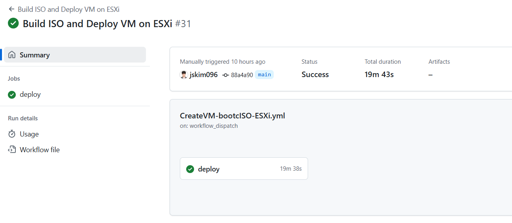
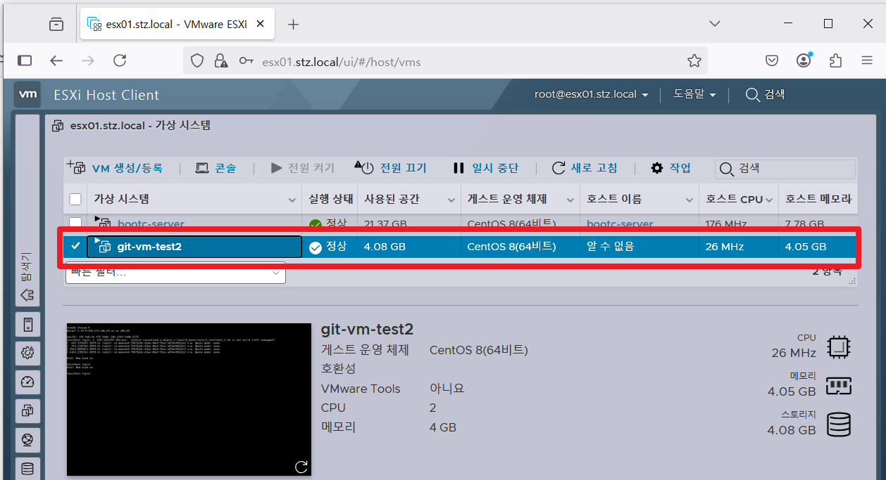
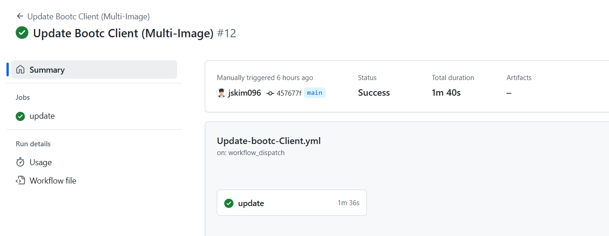
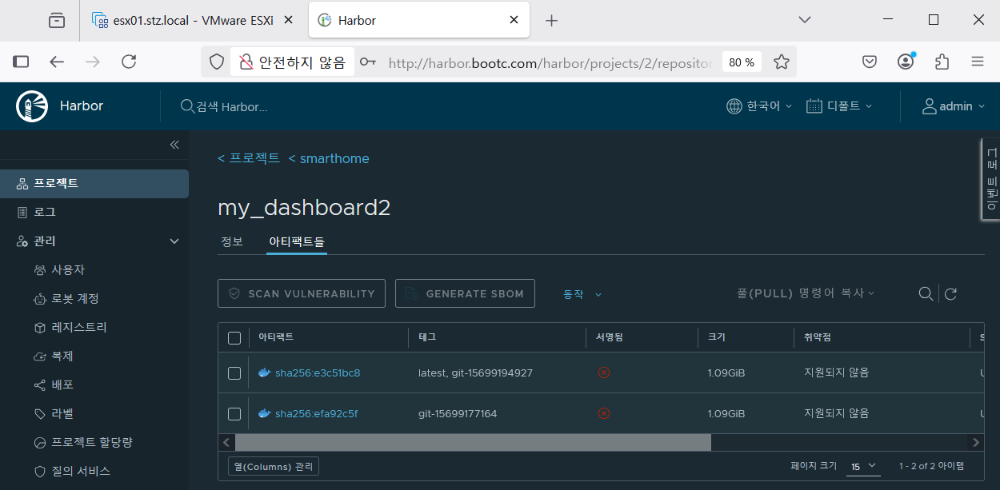

## 요약

```

컨셉 (왜 했는가)
 |
워크플로우 구성 (2가지 Git Action 흐름)
 |
워크플로우 결과 (2가지 Git Action 결과)
 |
테스트 (테스트를 통한 bootc 이해)
 +
피드백 (느낀점)

```


## 컨셉
- Github Action을 이용한 ESXi VM 자동화 파이프라인 형성

- Containerfile에는 **서비스 개념보단 OS에 초점을 맞춤**

- KISA의 리눅스 취약점 분석 평가 가이드 중 **'계정의 wheel 그룹 권한'** 과 **'파일 경로에 따른 권한 변경 불가'** 에 초점을 두었음

- wheel 그룹에 속하지 않은 일반 사용자는 su나 sudo 같은 명령어로 root 권한을 얻을 수 없게 제한할 수 있음

- /usr, /bin, /etc 등 주요 시스템 디렉터리는 운영체제의 핵심 파일이 위치한 경로로 bootc는 /usr, /bin을 읽기 전용으로 마운트 함

- 과연 컨테이너 파일에 **KISA 취약점 분석 가이드를 반영한 뒤, 생성한 OS에 대해 사용자가 설정을 바꾸면 바뀔까?**

- Hypervisor는 ESXi로 선택하여 원격지에서 python 코드로 VM 생성하는 Git을 참고  


---

## 워크플로우 구성
**CreateVM-bootcISO-ESXi.yml**
- 컨테이너 파일을 ISO로 빌드하고 파이썬 코드를 이용하여 ESXi VM 자동 생성 



  (1) Build ISO
  ```
  
  아래 KISA 취약점 진단 가이드를 포함한 컨테이너 파일을 이용하여 /output 하위에 bootc ISO 생성
  
  # Containerfile
  ---
  wheel 그룹 설정    +            패스워드 정책              +            계정 잠금 임계값            +       SUID/SGID 관련 보안 설정
   ( /etc/pam.d )     ( /etc/security/pwquality.conf )          ( /etc/security/faillock.conf )             ( /usr/bin/ )
  ```
  (2) Downlaod ISO
  ```
  Self-Runner는 ESXi로 SSH로 접근하고 wget을 통해 Bootc(Self-Runner)로 접근하여 ISO 파일을 다운로드

  * scp로 ISO 2.6GB를 넘기려했으나 3시간 이상이 소요되어 방법을 바꾸었고 8초로 단축 
  ```
  (3) Create VM
  ```
  esxi-vm-create.py를 이용하여 VM을 원격지에서 생성 가능하며 필요한 정보는 다음과 같음

  (1) ESXi 정보 (아이디/비밀번호/주소)
  (2) Datastore 경로
  (3) VM Name
  (4) VM CPU/MEM
  (5) VM DISK (Thin/Think 할당 방식도)
  (6) VM Geust OS 
  (7) VM Network
  ```


**Update-bootc-Client.yml**
- Harbor 레지스트리에 컨테이너 이미지를 관리하여 bootc 클라이언트 업데이트 



  (1) Build Container Image
  ```
  빌드된 이미지는 Bootc-Server의 Harbor 저장
  ```
  (2) Manage Bootc Client
  ```
  기존 실습과 동일하게 Harbor 레지스트리 PULL
  ```

---

## 워크플로우 결과
- CreateVM 워크플로우 결과 : Containerfile > Build ISO file > Create VM : 19분 소요



- CreateVM 가상머신 생셩 결과 : ESXi(가상화호스트 자동 생성)



- Update 워크플로우 결과 : New Containerfile > Build Container Image > Push Harbor : 2분 이내 소요



- Update Harbor 결과 : PUSH 정상



---

## 테스트
테스트 목록
```
(A) root 비밀번호 변경 : echo 'root:c!0udc1u6b0oC' | chpasswd

(B) 새로운 패키지 설치 : yum install openjdk *

(C) 유저 생성 : useradd cloudclubuser

(D) wheel 그룹 추가 : useradd -m -G wheel cloudclubadmin

(E) 패스워드 정책 변경 : sed -i '/^PASS_MAX_DAYS/c\PASS_MAX_DAYS   9999' /etc/login.defs

(F) 파일 권한 변경 : chmod 4777 /usr/bin/su *

(G) 파일 권한 변경 : chmod 777 /etc/shadow

(H) 파일 삭제 : rm -rf /bin *

(I) 파일 삭제 : rm -rf /etc

(J) 파일 삭제 : rm -rf /usr *

(K) Seliunx 비활성화 : getenforce 0

(L) 부트 로더 삭제 : rm -rf /boot/grub2 
```

bootc 수정 가능 목록
```
(A), (C), (D), (E), (G), (I), (K), (L)
```
bootc 수정 불가 목록 *
```
(B), (F), (H), (J)
```

## 피드백
- 버튼 한 번으로 ESXi VM 자동화 생성 및 버전 관리에 가능성에 대해 놀람

- 테스트 과정에서 rm -rf /etc 가 모두 삭제되어서 당황했으나 bootc rollback으로 복구

- 생각보다 수정 가능한 항목들이 많음 (에로 /etc, /boot 등)

- 레지스트리 Harbor에 컨테이너 이미지를 Push할 때 중복 데이터를 정확히 고려하지 않아 아쉬움 (태그로 관리하면 될까?)

- 여기서 CI/CD는 모르지만 테스트와 알림까지 더해지면 좋을 듯