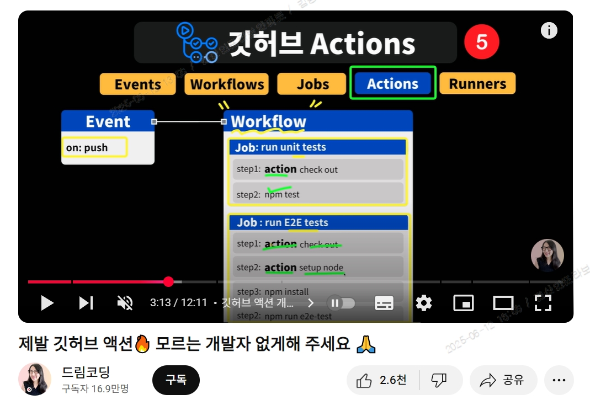

# 개요
```
[요약]
- 깃허브 액션을 통해 지금까지 해온 Bootc 컨테이너 이미지 빌드 과정을 자동화
- 저는 Bootc Server를 빌드 머신(Self-hosted Runner)으로 사용

[구성]
Github Action
      |
      V
Bootc Server   ㅡ>  Registry (Docker HUB)
(Action Runner)
```

# 깃허브 액션?

https://www.youtube.com/watch?v=iLqGzEkusIw
```
드림코딩이란 유튜버분이 잘 설명해줍니다!

[요약하면]
(1) Commit, PR 등 특정 이벤트가 발생할 때 자동으로 빌드·테스트·배포
(2) 빌드·테스트·배포를 원하는 나의 VM으로 지정하여 할 수 있음 (=Self-hosted Runner)
```

# 과정
```
[단계]
과정은 세 단계를 포함함.

1단계) Gtihub Action 생성

2단계) Github Action Runner 지정

3단계) Github Action 자동화 검증을 위한 Commit

그리고 단계별로 설명하겠습니다.
```

# 1단계) Github Action 생성
### (1) 깃허브 액션 파일 생성

.github/workflows 하위에 bootc-build-and-push.yml을 생성합니다.  
이때 runs-on에는 저의 가상머신로 구동하기 위해 self-hosted로 설정합니다.  
steps 하위에는 컨테이너 이미지 빌드 과정과 이미지를 도커 허브로 자동으로 업로드합니다.   
```
name: Build and Push Zabbix Image

on:
  push:
    branches: [main]
  workflow_dispatch:

jobs:
  build-and-push:
    runs-on: self-hosted
    steps:
      - uses: actions/checkout@v4

      - name: Podman 설치
        run: sudo dnf install -y podman

      - name: 이미지 빌드
        run: podman build -t my-zabbix-image:latest .

      - name: 레지스트리 로그인
        run: podman login -u ${{ secrets.REGISTRY_USER }} -p ${{ secrets.REGISTRY_PASS }} docker.io
        
      - name: 이미지 푸시
        run: podman push my-zabbix-image:latest docker.io/gag2012/github-zabbix:latest

```
### (2) Cotainerfile 작성

이미지 빌드를 위한 Continerfile을 작성합니다.  
해당 파일을 변경하면 즉시 저의 self-hosted runner vm에 변경사항을 반영합니다.  
예를 들면 Java 1.7 > Java 1.8 로 버전을 변경하여 적는 경우 1.8로 즉시 빌드합니다.  
심지어 파일 이름만 바꿔도 빌드합니다.  
왜냐하면 제가 위 Action yml의 on:에 main 브랜치에 push를 하면 동작하기 때문입니다.

만약 Containerfile이 변경되었을 때만 빌드를 하고 싶다면 아래와 같이 
'paths'로 제한을 거나봅니다.
```
on:
  push:
    branches:
      - main
    paths:
      - 'Containerfile'  # 루트의 Containerfile 변경 시에만 액션!
```
### (3) Action Secret 생성

action yml에 도커 HUB에 로그인하기 위한 계정 정보를 암호화하는 과정입니다.  
Settings > Security > Secrets and variables > Action 에서 확인 가능합니다.  
New repository secret 버튼을 눌러 파라미터를 KEY 형태로 저장합니다. 
```
      - name: 레지스트리 로그인
        run: podman login -u ${{ secrets.REGISTRY_USER }} -p ${{ secrets.REGISTRY_PASS }} docker.io
```

# 2단계) Github Action Runner 지정
### (1) Runner 선택

Actions > Runners > New runner > New self-hosted runner
### (2) Runner 환경 구성

Runner로 지정하고자 하는 서버(저같은 경우 bootc-server)에 접속하여 위 과정을 진행합니다.  
아무래도 Github > VM에 명령어를 실행시켜야 하다보니 에이전트 같은 러너앱을 설치하네요.  
찾아보니깐 HTTPS로 통신해서 JOB을 전달하고 실행하는 듯 합니다.
### (3) Runner 실행

./run.sh를 실행하면 정상적으로 연동이 되고 깃허브에서 대상 확인 가능합니다.  
근데 config 할때 아래와 같은 오류가 발생했는데 보안상 root로 실행하는걸 차단한다고 합니다.

```
[root@bootc-server actions-runner]# ./config.sh --url https://github.com/jskim096/bootc-study --token AJRGU4U35KZKAQXJ3GT5TU3IJIJ3W
Must not run with sudo
```
그래서 ROOT로 가능하도록 환경변수 설정했습니다.  
혹은 새로운 Runner 전용 유저를 생상하면 되지만 그냥 ROOT로 하겠습니다.
```
export RUNNER_ALLOW_RUNASROOT="1"
```
# 3단계) Github Action 자동화 검증을 위한 Commit
### (1) Action 첫시도

아주 좋은게 어디서 틀렸는지, 왜 틀렸는지, 언제했는지가 다 기록됩니다.  
action yml에 containerfile을 소문자로 적어서 이를 Containerfile로 변경해주었습니다.  
### (2) Action 성공!

정상적으로 Action에 성공한 화면입니다.
### (3) Action 결과

2주만에 도커 허브로 새로운 github-zabbix 이미지가 빌드되어 올라갔습니다.  
이제 컨테이너 파일을 변경하면 새로운 버전으로 올라갈까요?  
확인하려다 출근해버렸습니다.
# 느낀점
```
[Github Action]
- 기록 측면에서 아주 나이스 했습니다. 저의 업무 환경에서 운영/품질/개발 코드를 변경함에 있어서 주석을 제외하고는 기록을 알기 어렵습니다. 누가했는지 몇시에했는지 어떤걸 변경했는지 알기 추적하기 쉽지 않습니다. 보통은 history를 본다거나 수정파일명 뒤에 _bak, _bakbak, _v1, _v2, _v3_JJINrealfinal 이런식으로 붙이면서 기록하는데 10년전 파일을 보면 한숨만 나오거든요.

- 서버 자체에 들어가서 직접 Containerfile을 수정하면 빠를 수 있고 버전/기록/공유 용도로 접근하면 좋아보입니다.

- 다만 깃허브에 사내 코드를 올린다는 점이 불안하긴 합니다. 근데 이건 제가 깃허브를 안써봐서 그렇고 협업툴로 많이 쓰는거보면 안전하지 않을까요?

[Next Action]
- bootc upgrade를 아직 못해봐서 해보려합니다. (Swtich만 해봄)

- 만약 Github Action으로 여러 Commit을 통해 동일한 버전을 PUSH 한다거나, Docker HUB 기준으로 v1,v2,v3 버전 관리를 하려면 Containerfile 혹은 Action.yml을 어떻게 관리해야할 지 고민해보려 합니다.
```