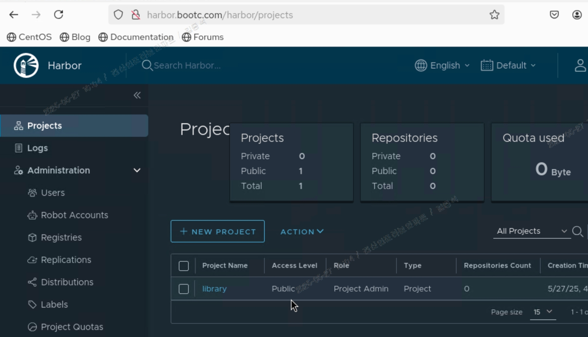

# INTRO
```
[IP 대역]

아래와 같이 2개로 가정하며 이는 물리적으로 망분리

- SITE A : 192.168.10.0/24
- SITE B : 10.10.10.0/24

[레지스트리]

총 3곳에서 클라이언트 배포 예정이며 아래와 같음

* SITE B의 Registry
* Docker Hub
* STIE B의 Harbor

[배포 버전]

컨테이너 이미지도 v1, v2, v3, v4 구분하여 활용
- v1 : zabbix 6.4
- v2 : zabbix 7.0 + Agent 2
- v3 : zabbix 7.0
- v4 : nginx, mariaDB

그러니깐 맨처음 클라이언트는 v1의 ISO 이미지를 설치하고 레지스트리에 따라 배포/롤백해본다.
이때 롤백은 최초 1회만 테스트한다.

[실습 순서]

CASE1) bootc registry : Private 레지스트리 CLI (v1>v2, v2>v1)
CASE2) Docker hub : Public 레지스트리 (v1>v3)
CASE3) harbor registry : Private 레지스트리 GUI (v3>v4)
```

# CASE1) bootc registry

---
```
목적 : bootc 레지스트리를 이용한 '배포(v1>v2)'와 '롤백(v2>v1)'
경로 : SITE B bootc > SITE B Client (내부 통신)
참고 : 간단했으나 소규모 환경에 적합해 보임
```
## 1-1. 레지스트리 생성 및 v2 이미지 push (서버)
docker run -d -p 5000:5000 --name localregistry registry:2  
podman push localhost:5000/bootc-zabbix:v2 --tls-verify=false

## 1-2. 레지스트리 목록 확인 (클라이언트)
curl http://10.10.10.153:5000/v2/_catalog
```
{"repositories":["bootc-zabbix"]}
```
## 1-3. 보안 HTTP 허용 (클라이언트)
vi /etc/containers/registries.conf
```
[[registry]]
location = "10.10.10.153:5000"
insecure = true
```
## 1-4. bootc switch v1>v2 (클라이언트)
bootc switch 10.10.10.153:5000/bootc-zabbix:v2 --apply  
이후 알아서 리부팅

## 1-5. bootc status v1>v2 (클라이언트)
bootc status
```
● Booted image: 10.10.10.153:5000/bootc-zabbix:v2
        Digest: sha256:02346eca8b5a5fce9b9b6cf0fa8c40c9f353ecf666b8085d105fcfda0ad7bb8d (amd64)
       Version: 9 (2025-05-27T05:57:28Z)

  Rollback image: localhost/bootc-zabbix:v1
          Digest: sha256:1a1943c652cfff5daa3efa73b3189f83e3cd71d1c10036946d31c5a36c9c06e7 (amd64)
         Version: 9 (2025-05-27T05:06:23Z)
```
## 1-6. 신규 버전 확인 v1>v2 (클라이언트)
v1 : zabbix 6.4  
v2 : zabbix 7.0 + Agent 2

zabbix_server -V
```
zabbix_server (Zabbix) 7.0.13
Revision 42673dd61ca 20 May 2025, compilation time: May 20 2025 00:00:00
```
systemctl status zabbix-agent2
```
● zabbix-agent2.service - Zabbix Agent 2
     Loaded: loaded (/usr/lib/systemd/system/zabbix-agent2.service; enabled; preset: disabled)
     Active: active (running) since Tue 2025-05-27 06:25:48 UTC; 3min 55s ago
   Main PID: 845 (zabbix_agent2)
      Tasks: 8 (limit: 24005)
     Memory: 20.5M
        CPU: 65ms
     CGroup: /system.slice/zabbix-agent2.service
             └─845 /usr/sbin/zabbix_agent2 -c /etc/zabbix/zabbix_agent2.conf

May 27 06:25:48 localhost.localdomain systemd[1]: Started Zabbix Agent 2.
May 27 06:25:48 localhost.localdomain zabbix_agent2[845]: Starting Zabbix Agent 2 (7.0.13)
May 27 06:25:48 localhost.localdomain zabbix_agent2[845]: Zabbix Agent2 hostname: [Zabbix server]
May 27 06:25:48 localhost.localdomain zabbix_agent2[845]: Press Ctrl+C to exit.
```
## 1-7. 롤백 (클라이언트)
bootc rollback
```
Next boot: rollback deployment
```
reboot

## 1-8. 롤백 버전 확인 v2>v1 (클라이언트)
bootc status
```
● Booted image: localhost/bootc-zabbix:v1
        Digest: sha256:1a1943c652cfff5daa3efa73b3189f83e3cd71d1c10036946d31c5a36c9c06e7 (amd64)
       Version: 9 (2025-05-27T05:06:23Z)

  Rollback image: 10.109.16.153:5000/bootc-zabbix:v2
          Digest: sha256:02346eca8b5a5fce9b9b6cf0fa8c40c9f353ecf666b8085d105fcfda0ad7bb8d (amd64)
         Version: 9 (2025-05-27T05:57:28Z)
```

zabbix_server -V
```
zabbix_server (Zabbix) 6.4.21
```

# CASE2 ) Docker Hub

---
```
목적 : 도커 허브 업로드 및 '배포(v1>v3)'
경로 : SITEA bootc push > 도커 외부 허브 > SITEB 클라이언트 deploy 
참고 : 컨테이너 올리자마자 7명이 다운로드 받아서 흠칫함. 망분리 및 다른 플랫폼(ESXi>Hyper-V)이어도
      배포 가능한 점 확인
```
## 2-1 docker hub 컨테이너 이미지 업로드 (SITE A Bootc 서버)
(1) podman login docker.io에 로그인  
(2) 이후 push v3 이미지 (이는 SITE A에서 업로드 한 건)


## 2-2 docker hub 업로드 확인 (SITE A Bootc 서버)
누구나 접속할 수 있는 Pubilc 저장소인지 올리자마자 7명 다운로드함


## 2-3 외부 도커에서 가져오기 (SITE B 클라이언트, v1>v3)
(1) Docker Hub에 원하는 이미지가 있는 지 확인  
curl https://registry.hub.docker.com/v2/repositories/gag2012/bootc-zabbix/tags/  
(2) v3 이미지에 대한 버전/용량/일자 등을 조회할 수 있으므로 Switch 시도  
bootc switch docker.io/gag2012/bootc-zabbix:v3 --apply


bootc status  
```
● Booted image: docker.io/gag2012/bootc-zabbix:v3
        Digest: sha256:c5a4ba0d5209c03ffaf3cbcc1d31d8803856e5f47f868593a9093de1ae9cf5b5 (amd64)
       Version: 9 (2025-05-26T23:09:56Z)

  Rollback image: localhost/bootc-zabbix:v1
          Digest: sha256:1a1943c652cfff5daa3efa73b3189f83e3cd71d1c10036946d31c5a36c9c06e7 (amd64)
         Version: 9 (2025-05-27T05:06:23Z)
```
# CASE3 ) harbor registry

---
```
목적 : Private WEB 페이지를 이용한 컨테이너 이미지 배포/관리 (Docker v3 > Harbor v4)
경로 : SITE B bootc > SITE B Harbor > SITE B Client
참고 : 배포/버전/권한 등 관리자 측면에서 편리해 보였음
```
## 3-1 Harbor 설치 (서버, 간단하게 HTTP로만)

(1) Docker Compose 설치  
sudo curl -L "https://github.com/docker/compose/releases/latest/download/docker-compose-\$(uname -s)-\$(uname -m)" -o /usr/local/bin/docker-compose
```
  % Total    % Received % Xferd  Average Speed   Time    Time     Time  Current
                                 Dload  Upload   Total   Spent    Left  Speed
  0     0    0     0    0     0      0      0 --:--:-- --:--:-- --:--:--     0
  0     0    0     0    0     0      0      0 --:--:-- --:--:-- --:--:--     0
100 71.2M  100 71.2M    0     0  4184k      0  0:00:17  0:00:17 --:--:-- 4961k
```
chmod +x /usr/local/bin/docker-compose  
docker-compose version
```
Docker Compose version v2.36.2
```
(2) Harbor 다운로드 및 설치  
wget https://github.com/goharbor/harbor/releases/download/v2.10.0/harbor-online-installer-v2.10.0.tgz  
tar xvf harbor-online-installer-v2.10.0.tgz   
vi harbor.yml  
```
hostname: harbor.bootc.com
# https related config (주석)
```

(3) Harbor 설치  
./install.sh (반짝반짝 이쁨)


(4) Harbor 홈페이지 접속  
ID : admin / PW : Harbor12345



## 3-2 Harbor에 bootc 이미지 업로드 (서버)
(1) PODMAN 보안 설정  
 vi /etc/containers/registries.conf
 ```
[[registry]]
location = "harbor.bootc.com:80"
insecure = true
```
(2) PODMAN 재실행  
systemctl restart podman

(3) Harbor 로그인 시도  
podman login harbor.bootc.com:80


## 3-3 Harbor에 올릴 새로운 컨테이너 이미지 생성 v4 (서버)
(1) Contianer_harbor 작성 : v4
```
FROM quay.io/centos-bootc/centos-bootc:stream9

RUN dnf install -y nginx mariadb-server mariadb
RUN systemctl enable nginx mariadb

RUN bootc container lint

LABEL containers.bootc=1
LABEL ostree.bootable=1
```

(2) 생성 (단, harbor에 업로드하기 위해 이름은 아래와 같이 생성 url:port/project/images)  
podman build -t harbor.bootc.com:80/sales/nginx-mariadb:v1 -f Containerfile_harbor .

(3) 이미지 확인 (Harbor v1 = 실습 v4로 가정)    
podman images
```
REPOSITORY                                TAG         IMAGE ID      CREATED        SIZE
harbor.bootc.com:80/sales/nginx-mariadb   v1          ccf857be1459  7 minutes ago  1.94 GB
```
(4) Harbor 프로젝트 생성 (name : sales)    


(5) podman push to harbor sales repo  
podman push harbor.bootc.com:80/sales/nginx-mariadb:v1


(6) Harbor > sales 프로젝트 > 정상 업로드 확인  


# 3-4 Clinet > Harbor Switch v3>v4 (클라이언트)
v3 : SITE A에서 PUSH한 Docker Zabbix 7.0 : v3  
v4 : SITE B에서 PUSH한 Harbor nginx + mariaDB : v1  

(1) PODMAN 보안 설정  
 vi /etc/containers/registries.conf
 ```
[[registry]]
location = "harbor.bootc.com:80"
insecure = true
```
(2) PODMAN 재실행  
systemctl restart podman

(3) Harbor 로그인  
podman login harbor.bootc.com:80

(4) 클라이언트 > Harbor swtich 1차 시도 : 실패  
(Error ! :권한 문제 발생하여 Public으로 변경)  
bootc switch harbor.bootc.com:80/sales/nginx-mariadb:v1 --apply
```
ERROR Switching: Creating importer: failed to invoke method OpenImage: failed to invoke method OpenImage: reading manifest v1 in harbor.bootc.com:80/sales/nginx-mariadb: unauthorized: unauthorized to access repository: sales/nginx-mariadb, action: pull: unauthorized to access repository: sales/nginx-mariadb, action: pull

따라서 아래와 같이 Private > Public 변경
```


(5) 클라이언트 > Harbor swtich 2차 시도 : 정상


(6) 스위칭 및 리부팅 이후 bootc status (대략 60초 소요)  

bootc status
```
● Booted image: harbor.bootc.com:80/sales/nginx-mariadb:v1
        Digest: sha256:7fb05fb00d1f98373bba7e2dde2270ef33fc84d4098507d0419cf221c4ea2917 (amd64)
       Version: 9 (2025-05-27T08:33:16Z)

  Rollback image: docker.io/gag2012/bootc-zabbix:v3
          Digest: sha256:c5a4ba0d5209c03ffaf3cbcc1d31d8803856e5f47f868593a9093de1ae9cf5b5 (amd64)
         Version: 9 (2025-05-26T23:09:56Z)
```
systemctl status mariadb
```
× mariadb.service - MariaDB 10.5 database server
     Loaded: loaded (/usr/lib/systemd/system/mariadb.service; enabled; preset: disabled)
     Active: failed (Result: exit-code) since Tue 2025-05-27 08:59:22 UTC; 58s ago
       Docs: man:mariadbd(8)
             https://mariadb.com/kb/en/library/systemd/

```
systemctl status nginx
```
× nginx.service - The nginx HTTP and reverse proxy server
     Loaded: loaded (/usr/lib/systemd/system/nginx.service; enabled; preset: disabled)
     Active: failed (Result: exit-code) since Tue 2025-05-27 08:59:22 UTC; 1min 6s ago
        CPU: 19ms
```


## 별도 실습 : 도커 이미지 만들기 save

(1) v3 이미지 확인  
podman images
```
REPOSITORY                                TAG         IMAGE ID      CREATED         SIZE
localhost/bootc-zabbix                    v3          27b9e905fc98  9 minutes ago   1.93 GB
```
(2) docker/podman v3 이미지 save  
podman save -o bootc-zabbix-v3.tar localhost/bootc-zabbix:v3  
이를 다른 폐쇄망 Docker 환경에 부으면 되겠구나
```
Copying blob a75c824d5854 done   |
Copying blob f1c975aab2e5 done   |
Copying blob 4483b8b84a81 done   |
Copying blob 9b409f7ed408 done   |
Copying blob 419461c56f6f done   |
Copying blob 18563341cc6a done   |
Writing manifest to image destination
```

# Result
```
실습은 마치며 느낀점은 다음과 같음

[호환성]
- 망분리되었고 또 다른 가상화 플랫폼(ESXi>Hyper-V)이지만 도커 이미지 실행 가능
- 이는 표준이 정혀져있기 때문이고 OCI 이미지 표준을 따르기에 다른 환경에서도 호환 가능
- bootc는 OS를 포함한 '도커' 이미지를 이용하기에 차후 호환 가능한 운영체제가 확장 될 듯

[실용성]
- 운영 하다보면 운영체제 EOS에 따른 기술지원이 불가하여 OS/Kernel 업그레이드 필요
- 앞선 실습에서는 ContainerFile의 OS만 CentOS 6 > 10 숫자만 변경해도 빠른 구성 가능
- 항상 OS 버전 업그레이드에는 서비스(WEB/WAS/DB)와의 호환성이 중요하고 검토 과정이 매우 김
- 이를 테스트 환경에서 CentOS 7, 8, 9, 10 다 배포해놓고 자 봐봐 호환되잖아? 가능
- 개발/품질/운영 환경 배포에도 같은 컨테이너 파일을 사용하기에 구축 과정에서 휴먼에러 발생이 적음

[확장성]
- 지금은 한 대의 클라이언트이나 1,000대 이상 서버를 운영한다면 bootc switch 일일이 해줘야함
- 그래서 Ansible과 같은 자동화 툴과 연동하여 bootc 운영해야 진정한 자동화가 아닐까

[비용성]
- 그럼 우리 회사에선 이를 채택할까? 7년 뒤에 옆에 기업들이 하면 따라할 듯 하다.
- 서비스 업계와 같이 빠른 환경 변화가 필요한 기업이라면 도입 가치 있음
- 다만 안정성을 우선시하는 기업이라면 당장은 보류할 듯
- 오픈소스이기도 하고 bootc 커뮤니티가 활발해졌으면 좋겠다ㅎㅎ
```
