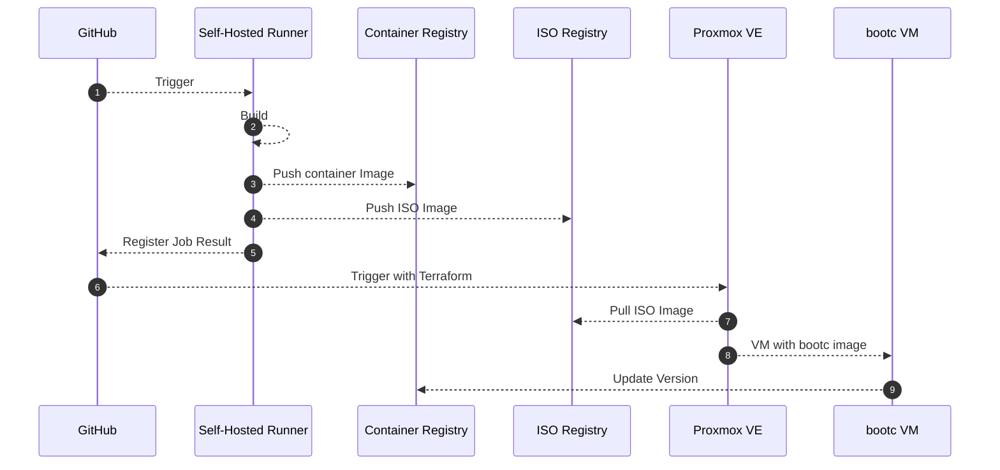

# ISO CI/CD Pipeline

PoC 수준에서, 1) GitHub Actions를 통해 ISO/Container 이미지를 빌드하고, 2) 레지스트리에 Push하고 3) Proxmox VE에서 Terraform을 통해 bootc 기반 VM을 프로비저닝.

## Diagram



## Self-Hosted Runner

PoC이기 때문에, 우선 생성되어있던 Proxmox 내 VM을 self-hosted runner로 사용.  
Proxmox VM 또한 [Terraform AWS GitHub Runner](https://github.com/github-aws-runners/terraform-aws-github-runner/tree/main)를 참고하여 Terraform을 통해 프로비저닝

## GitHub Actions Workflows - ISO/Conterner Image Build

1. Create user account for self-hosted runner
   - Grant no-password sudo access
   - `echo "self-hosted ALL=(ALL) NOPASSWD: ALL" | sudo tee /etc/sudoers.d/self-hosted`
2. Podman Installation/Verification
   - `podman --version`
3. Issue Docker Hub Access Token
   - [Docker Hub Access Token](https://docs.docker.com/docker-hub/access-tokens/)
   - Registered it on GitHub Secrets as `DOCKER_HUB_USER`, `DOCKER_HUB_ACCESS_TOKEN`
4. Register Registry Information - `podman login docker.io --username <username> --password <access_token>`
5. NFS Mount
   - `mount -t nfs <nfs_server_ip>:/path/to/nfs /mnt/nfs`
6. Build Container Image
   - `podman build -t <image_name> .`
   - `podman push <image_name> docker.io/<username>/<image_name>:<tag>`
7. Build ISO Image

   ```bash
   sudo podman run \
   --rm \
   -it \
   --privileged \
   --pull=newer \
   --security-opt label=type:unconfined_t \
   -v ./config.toml:/config.toml:ro \
   -v ./output:/output \
   -v /var/lib/containers/storage:/var/lib/containers/storage \
   quay.io/centos-bootc/bootc-image-builder:latest \
   --type qcow2 \
   --use-librepo=True \
   quay.io/centos-bootc/centos-bootc:stream9
   ```

8. Push Container Image to Registry
   - `podman push <image_name> docker.io/<username>/<image_name>:<tag>`
9. Move ISO Image to NFS
   - `mv /path/to/iso /mnt/nfs/iso/`

## Terraform Proxmox VE

- Refer to [Proxmox VE Terraform Provider](https://registry.terraform.io/providers/Terraform-for-Proxmox/proxmox/latest/docs)
